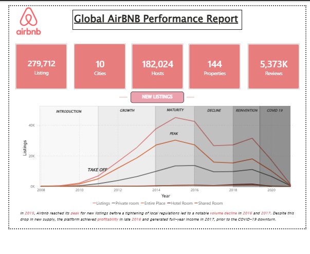
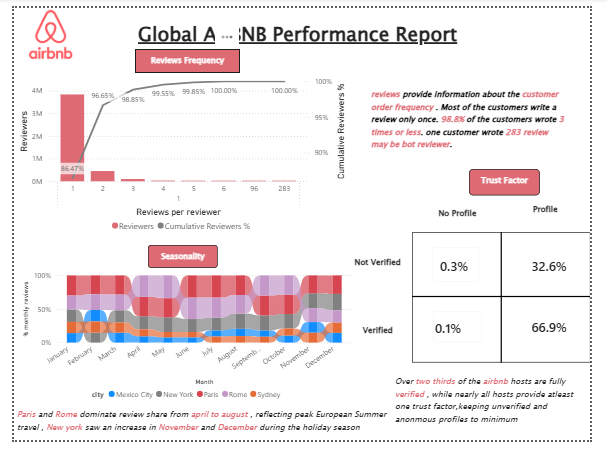
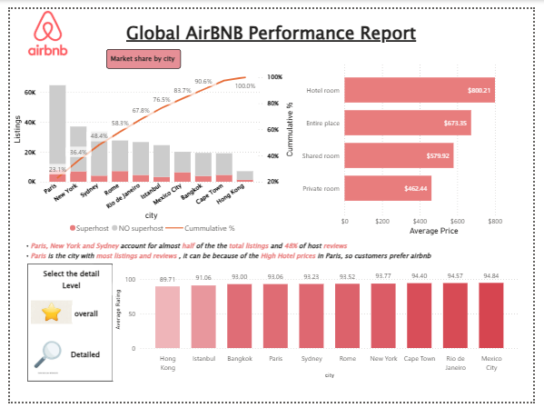

# 🏠 Global Airbnb Performance Analysis — Power BI Dashboard

An interactive Power BI dashboard analyzing **279,712 Airbnb listings** across **10 global cities**, covering **182,024 hosts** and **5.37M+ reviews** — from platform take-off (2008) through the COVID-19 downturn.

## 📊 Dashboard Pages

### 1. Overview — Platform Lifecycle

Tracks new listing volume across six market phases: Introduction → Growth → Maturity → Decline → Reinvention → COVID-19.

**Key insights:**
- New listings **peaked in 2015**, before tightening local regulations drove a volume decline through 2016–2017
- Despite the drop in new supply, the platform reached **profitability in late 2016** and generated full-year income in 2017
- Entire Place and Private Room dominate the listing mix across all phases

### 2. Listings — Market Share by City

**Key insights:**
- **Paris, New York, and Sydney** account for nearly **half of all listings** and 48% of host reviews
- Paris leads with the most listings and reviews — likely driven by high hotel prices pushing travelers toward Airbnb
- Average price by room type: Hotel Room ($800) > Entire Place ($673) > Shared Room ($580) > Private Room ($462)
- Average ratings are consistently high (89–95) across all 10 cities, with Mexico City and Rio de Janeiro rated highest

### 3. Ratings & Reviews — Customer Behavior & Trust

**Key insights:**
- **98.8% of customers wrote 3 reviews or less** — most review only once (86.5%); one outlier account wrote 283 reviews (possible bot)
- **Seasonality:** Paris and Rome dominate review share April–August (European summer travel); New York spikes in November–December (holiday season)
- **Trust factor:** Over two-thirds of hosts are fully verified with complete profiles (66.9%); unverified + anonymous hosts are a negligible 0.3%

## 🛠️ Tools & Techniques
- **Power BI Desktop** — data modeling, DAX measures, interactive visuals
- **Power Query** — data cleaning and transformation
- Pareto (cumulative %) analysis, lifecycle segmentation, ribbon charts for seasonality, drill-down detail levels

## 📁 Files
| File | Description |
|------|-------------|
| `airbnb_dashboard.pbix` | Power BI report file (open in Power BI Desktop) |
| `assets/` | Dashboard screenshots |

## 🚀 How to View
1. Download `airbnb_dashboard.pbix` from [Google Drive](https://drive.google.com/drive/folders/1dT6dX0DGhPIZoElbEFDx3L33nL8BetWw)
2. Open with [Power BI Desktop](https://powerbi.microsoft.com/desktop/) (free)
3. Interact with slicers, drill-downs, and cross-filtering

---
**Author:** Mahipal Singh Rajput · [GitHub](https://github.com/Codespydii)
